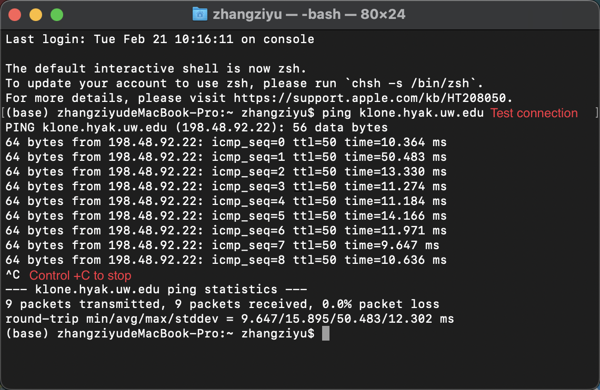
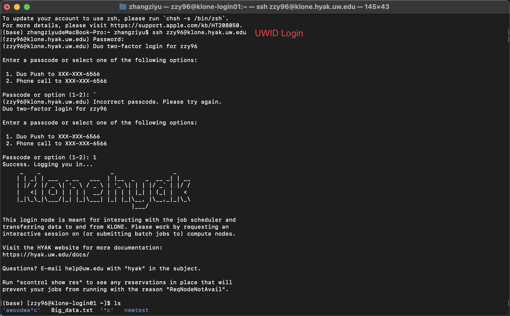
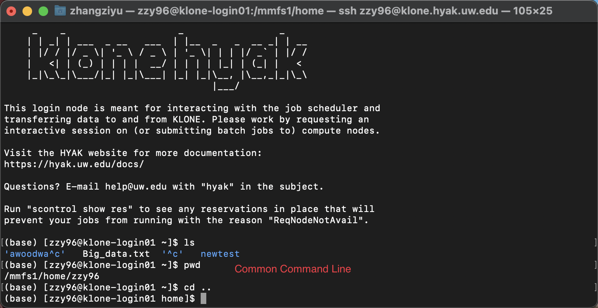

# MSE544_Week1_Hands_on

## Hands-on 1: Sign up for Hyak and Use some basic Command line

Authors: Ting Cao & [Ziyu Zhang](https://github.com/Ilxxll) & Kaichen Xie

### Table of Content

- [Task 1: Sign up for membership in the STF group.](#task1)
- [Task 2: Locate a terminal or SSH client on your computer.](#task2)
- [Task 3: Familiarize yourself with the command line.](#task3)
- [Task 4: Use Vi to create a file with 2-3 sentences about what the term ‘Big Data’ means to you.](#task4)
- [Task 5: Familiarize yourself with file transfers.](#task5)

## Task 1 - Sign up for membership in the STF group.<a name="task1"></a>

#### Step 1:
Go to the Hyak Research Computing Club(RCC) getting-start Webpage: [https://depts.washington.edu/uwrcc/hyak_access/](https://depts.washington.edu/uwrcc/hyak_access/) and follow the instruction to finish the sign-up.

#### Step 2:

Read the [`Wiki page for Hyak`](https://hyak.uw.edu/docs/) and get familiar with Hyak setup. The wiki provides detailed information on how to access and use Hyak, including instructions on how to log in, set up software, run jobs, and manage data storage. It also includes troubleshooting tips and answers to common questions. Reading the wiki will help you gain a better understanding of how to effectively use Hyak for your research needs.

## Task 2 - Locate a terminal or SSH client on your computer.<a name="task2"></a>

### Step 1: Set up your terminal

#### For Mac users: You can use `Terminal`.

You can use Spotlight Search to open Terminal:
- Open Spotlight Search by pressing `Command + Space` on your keyboard.
- Type 'Terminal' in the search bar and press enter. This will open the Terminal application.

#### For windows users: You can use `Windows Terminal`

For windows users, you can open a Windows Powershell command by hitting the Windows key, typing `Powershell` and pressing `Enter`. 


### Step 2: Start becoming comfortable using these command line interfaces if you are not already.

Like with any new skill, using command line interfaces (CLIs) takes practice and persistence to become proficient. It can be daunting to start using the command line, but with practice and patience, you can become more comfortable and confident with this powerful tool. Here is a webpage that can help you get familiar with Command line. 

[https://www.git-tower.com/blog/command-line-cheat-sheet/](https://www.git-tower.com/blog/command-line-cheat-sheet/)

### Step 3: Test connection with Hyak:

In your terminal window, input `ping klone.hyak.uw.edu` to test 

And then use `control + C` to stop the ping



### Step 4: Connect to Hyak!

Input `ssh uwid@klone.hyak.uw.edu` to connect to Hyak

your UW user id should replace USERID.



## The rest instructions can be either worked on hyak or local

## Task 3 Familiarize yourself with the command line.<a name="task3"></a>

Like with any new skill, using command line takes practice and persistence to become proficient. It can be daunting to start using the command line, but with practice and patience, you can become more comfortable and confident with this powerful tool.

One way to get started is to set aside some time to explore the command line and try out different commands and options. You can start with basic commands like: cd (change directory), ls (list), pwd (print working directory), mkdir (create new directory), rm (remove), vi (open file with the vim editor).



#### Additional resources:

https://www.youtube.com/watch?v=5RTSlby-l9w&ab_channel=PercyGrunwaldfromTopTechSkills (video for WSL installation and access)
https://www.git-tower.com/blog/command-line-cheat-sheet/ (cheat sheet)
https://ubuntu.com/tutorials/command-line-for-beginners#1-overview (pedagogical overview)


## Task 4 Use `Vi` to create a file with 2-3 sentences about what the term ‘Big Data’ means to you.<a name="task4"></a>

- 1. Open a terminal window / Connect to Hyak.
- 2. Navigate to the directory where you want to create the file. For example, if you want to create the file in your home directory, type `cd ~` and press Enter.
- 3. Type `vi big_data.txt` and press Enter to create a new file called `big_data.txt` using the Vi text editor.
- 4. Press `i` to enter insert mode and start typing your 2-3 sentences about what Big Data means to you.
- 5. Once you've finished writing, press the `Esc` key to exit insert mode.
- 6. Type `:wq` (including the colon) and press Enter to save the file and exit the Vi editor.

#### Additional resources:

https://www.guru99.com/the-vi-editor.html

cheatsheet of vim command: https://vimsheet.com/


## Task 5 Familiarize yourself with file transfers.<a name="task5"></a>

Once you are approved by STF, practice moving some files from your local computer to your scratch
directory.

#### For Mac user: You can use `Terminal`. 

Input `scp $local_directory uwid@klone.hyak.uw.edu:$remote_directory` to transfer files from your local computer to a HYAK directory. 

Please be aware that $remote_directory should start with `/`. 

## **For Mac Users: Using Terminal**
You can use the `scp` (secure copy) command in Terminal to transfer files.  

### **Transferring a file from your local computer to HYAK:**
```bash
scp /path/to/local_file uwid@klone.hyak.uw.edu:/gscratch/your_group/your_directory/
```
- **Replace `/path/to/local_file`** with the actual path of the file you want to transfer.
- **Replace `uwid`** with your UW NetID.
- **Replace `/gscratch/your_group/your_directory/`** with your **remote directory** on HYAK.  
  - For example:  
    ```bash
    scp myscript.py uwid@klone.hyak.uw.edu:/gscratch/mylab/myfolder/
    ```
    This will copy `myscript.py` from your local machine to the `myfolder` directory in your HYAK scratch space.

### **Transferring a file from HYAK back to your local computer:**
After transferring files to HYAK, practice copying a file back to your local machine.  
For example, if you generated a file `output.txt` on HYAK, use:
```bash
scp uwid@klone.hyak.uw.edu:/gscratch/mylab/myfolder/output.txt /path/to/local_directory/
```
- **Replace `/path/to/local_directory/`** with the actual folder on your local machine where you want to store the file.


#### For Windows user: You can use `Windows Terminal`.

Similarly, input `scp $local_directory uwid@klone.hyak.uw.edu:$remote_directory` to transfer files from your local computer to a HYAK directory. 

Also, you can use some third-party software to transfer files like XShell, WinSCP or any other client. 

## Assignment

Upload the `big_data.txt` file created in the fourth task to canvas.
